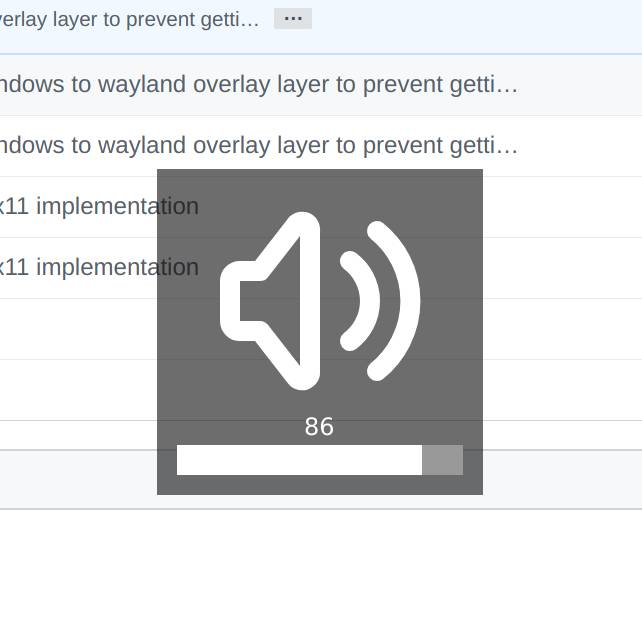
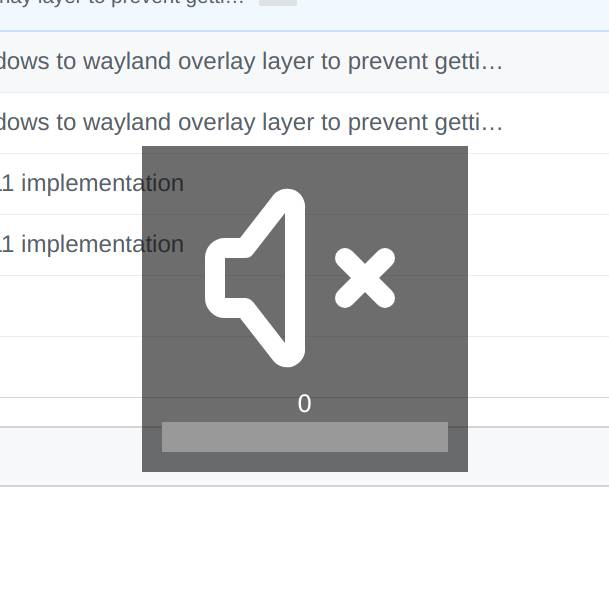
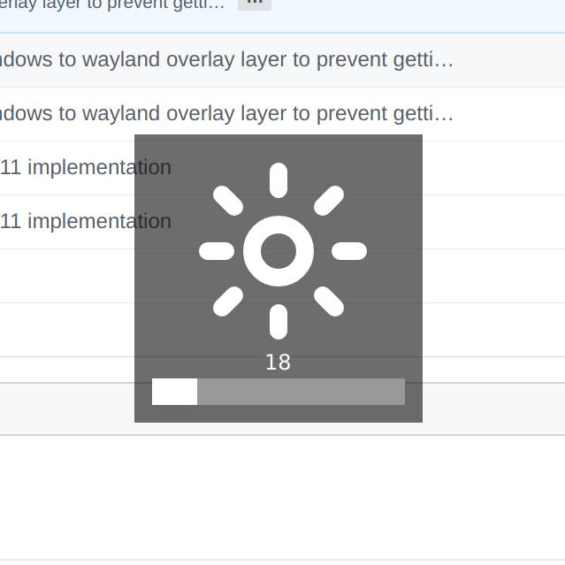

osdtools
========

These are some tools that provide OSD functionality for volume and brightness.


### Screenshots

Here is what they look like:






### Install

They are written in Go, using GTK, and are built with Wayland in mind.
Compiling them takes a while, and the binaries are big. You have been warned.
Install `gtk3`, `gtk-layer-shell` and the `go` compiler and then you can
install these tools with:

```
go get -u github.com/osdtools/cmd/...
```


### Run

The tools don't modify volume or brightness, they just do the OSD bits. So for
example, if you use `light` for managing brightness:

```
osdbrightness -brightness $(light -G | sed -e 's/\..*//')
```

Similarly, once you find your volume level from some tool:

```
osdvol -volume 42
```
